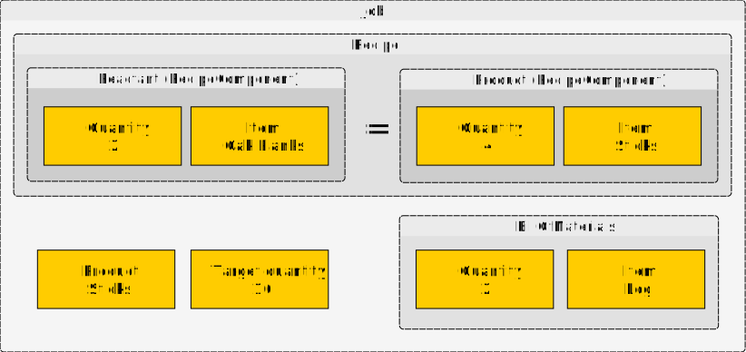

# aequus

A recursive recipe calculator inspired by chemistry

## What is this for?

Aequus helps you calculate the total quantities of raw materials for recipes. The recipes can be simple or have dozens of ingredients. For ingredients that are themselves creatable, it can recurse through them until you arrive at a complete calculation of every raw material needed to create something.

"Aequus" is a Latin word that can mean "equal" or "like." This application draws inspiration from chemical equations because balancing chemical equations and complex recipes share many concepts.

You can use this program for cooking recipes in real life, crafting recipes in simulations or video games (like Minecraft), or anywhere recipes appear. It is designed in an abstract way to allow the definition of recipes of many kinds.

## How do I run it?

Calculate the total raw materials needed to create 16 sticks in Minecraft:

```bash
python -m calc product_name target_quantity [source_mod]
python -m calc stick 16
```

The source mod is only required if multiple items exist in the `ItemDatabase` sharing the same name.

```text
Product: Stick
Target quantity: 16

Bill of raw materials:
2 Log

Explanation:
2 Log = 8 Oak Planks = 16 Sticks
```

## Features

- Recursive calculation of raw materials
- Support for probabilistic ingredients (things created through a chance-based process)
- Define jobs to produce n quantity of an item and calculate the raw materials needed for the job
- Define multiple recipes per product

## Object model

| Entity | Definition | Example |
| ------ | ---------- | ------- |
| `Item` | Something that exists in a stable form, whether it can be made or gathered | Stick |
| `RecipeComponent` | A combination of an `Item` and a quantity | 2 Oak Planks |
| `Reactant` | A `RecipeComponent` that is used to create one or more `Products` | 2 Oak Planks |
| `Product` | A `RecipeComponent` that is created from one or more `Reactants` in a recipe | 4 Sticks |
| `Recipe` | A group of `Reactants` and `Products` | 2 Oak Planks = 4 Sticks |
| `BillOfMaterials` | A collection of `Reactants` that have been recursively reduced to their raw materials | 2 Log |
| `Job` | A combination of a `Recipe`, the desired `Product`, a target quantity, and a `BillOfMaterials` (BOM) | Recipe: (2 Oak Planks = 4 Sticks), Product: Sticks, Target quantity: 16, BOM: 2 Log |
| `ItemDatabase` | A collection of known `Items` | Stick, Button, Oak Planks |
| `RecipeDatabase` | A collection of `Recipes` associated with `Products` | Product: Stick, Recipe: 2 Oak Planks = 4 Sticks |

### Figure 1 - A Job to create 16 Sticks



### Mathematical equation for stick crafting

The following equations are a mathematical expression of crafting 16 sticks. It models the full series of subcomponents, tracing back to the Log raw material.

Step 1 - Express the chain of recipes to craft 16 sticks

$$ \frac{16\text{ Sticks}}{1}\cdot\frac{2\text{ Oak Planks}}{4\text{ Sticks}}\cdot\frac{1\text{ Log}}{4\text{ Oak Planks}} $$

Step 2 - Reduce fractions

$$ \frac{\cancel{\color{red}{16}}\text{ 4 Sticks}}{1}\cdot\frac{2\text{ Oak Planks}}{\cancel{\color{red}{4}}\text{ 1 Sticks}}\cdot\frac{1\text{ Log}}{4\text{ Oak Planks}} $$

$$ \frac{4\text{ Sticks}}{1}\cdot\frac{2\text{ Oak Planks}}{1\text{ Sticks}}\cdot\frac{1\text{ Log}}{4\text{ Oak Planks}} $$

$$ \frac{4\text{ Sticks}}{1}\cdot\frac{\cancel{\color{red}{2}}\text{ 1 Oak Planks}}{1\text{ Sticks}}\cdot\frac{1\text{ Log}}{\cancel{\color{red}{4}}\text{ 2 Oak Planks}} $$

$$ \frac{4\text{ Sticks}}{1}\cdot\frac{1\text{ Oak Planks}}{1\text{ Sticks}}\cdot\frac{1\text{ Log}}{2\text{ Oak Planks}} $$

Step 3 - Cancel like units

$$ \frac{4\text{ } \cancel{\color{red}{\text{Sticks}}}}{1}\cdot\frac{1\text{ Oak Planks}}{1\text{ } \cancel{\color{red}{\text{Sticks}}}}\cdot\frac{1\text{ Log}}{2\text{ Oak Planks}} $$

$$ \frac{4}{1}\cdot\frac{1\text{ Oak Planks}}{1}\cdot\frac{1\text{ Log}}{2\text{ Oak Planks}} $$

$$ \frac{4}{1}\cdot\frac{1\text{ } \cancel{\color{red}{\text{Oak Planks}}}}{1}\cdot\frac{1\text{ Log}}{2\text{ }\cancel{\color{red}{\text{Oak Planks}}}} $$

$$ \frac{4}{1}\cdot\frac{1}{1}\cdot\frac{1\text{ Log}}{2} $$

Step 4 - Apply the identity property of multiplication

$$ \frac{4}{1}\cdot\cancel{\color{red}{\frac{1}{1}}}\cdot\frac{1\text{ Log}}{2} $$

$$ \frac{4}{1}\cdot\frac{1\text{ Log}}{2} $$

Step 5 - Multiply fractions

$$ \frac{4\cdot1\text{ Log}}{1\cdot2} $$

$$ \frac{4\text{ Log}}{2} $$

Step 6 - Reduce fraction

$$ \frac{\cancel{\color{red}{4}}\text{ 2 Log}}{\cancel{\color{red}{2}}\text{ }1} $$

$$ \frac{2\text{ Log}}{1} $$

Step 7 - Apply the identity property of division

$$ 2\text{ Log} $$

$$ 16\text{ Sticks} = 2\text{ Log} $$

Aequus automates these operations for any recipe to determine equivalence between a desired product and the raw materials needed to make the chain of subcomponents that make up that product.
